# Warehouse Operations — System Architecture

> Visual architecture reference for the fragrance/cosmetics warehouse application.  
> Companion to [design.md](../design.md) (technical detail) and [spec.md](../spec.md) (requirements).

---

## 1. System Context (C4 — Level 1)

Who uses the system and what it connects to.

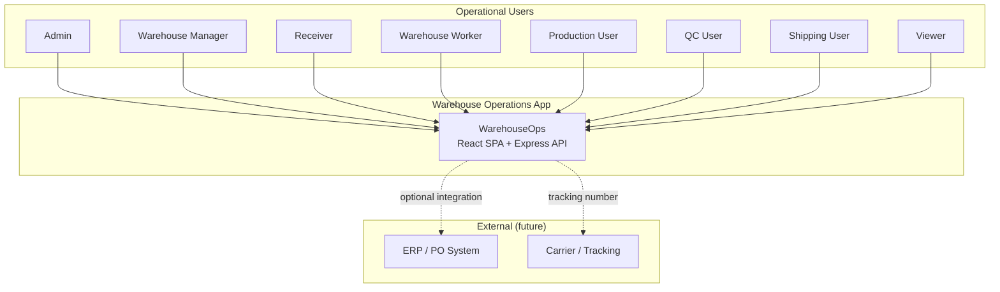

| Actor | Primary concern |
|-------|-----------------|
| Receiver | Inbound materials, lots, pallets, locations |
| Warehouse Worker | Moves, picks, cycle counts |
| Production User | Orders, material requests, consumption |
| QC User | Lot inspection and release |
| Shipping User | Outbound shipments (QC-passed FG only) |
| Warehouse Manager | Dashboards, inventory oversight |
| Admin | Users, roles, full access |
| Viewer | Read-only status |

---

## 2. Container Architecture (C4 — Level 2)

Major deployable parts and how they communicate.

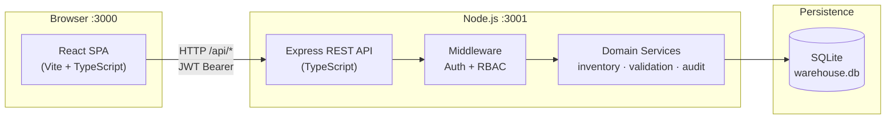

| Container | Technology | Responsibility |
|-----------|------------|----------------|
| React SPA | Vite, React 18, TS | UI, RBAC-aware navigation, forms, dashboards |
| Express API | Node.js, Express, TS | Business rules, auth, REST endpoints |
| SQLite | better-sqlite3 | Single-file relational store, WAL mode |

**Local dev proxy:** Vite forwards `/api` → `http://localhost:3001`.

---

## 3. Layered Backend Architecture

Clean separation inside the API server.

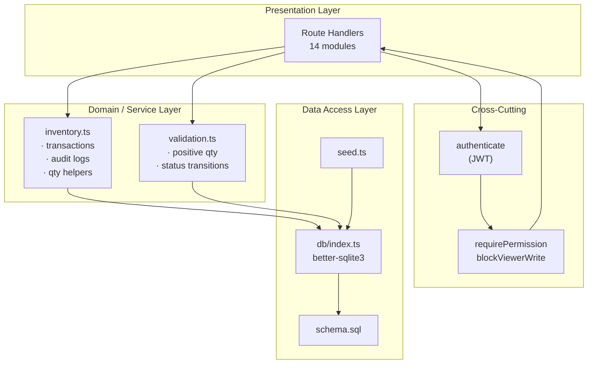

### Request lifecycle

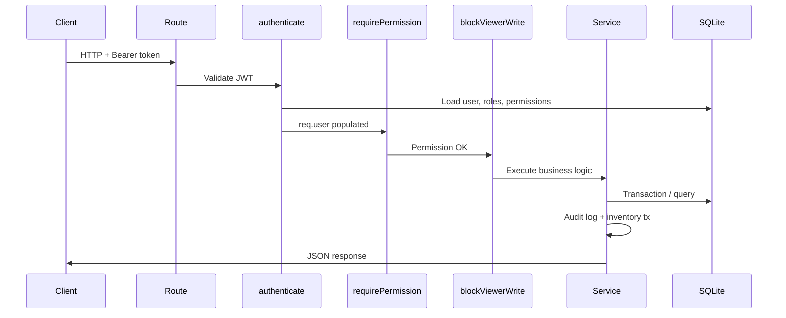

---

## 4. Frontend Architecture

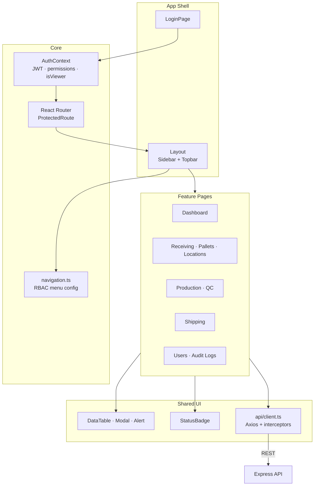

### RBAC on the client (defense in depth)

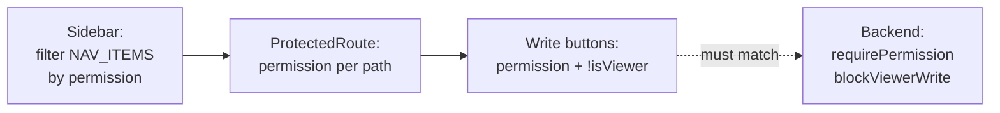

The UI hides unauthorized actions; the API **always** enforces permissions regardless of UI.

---

## 5. Security & RBAC Architecture

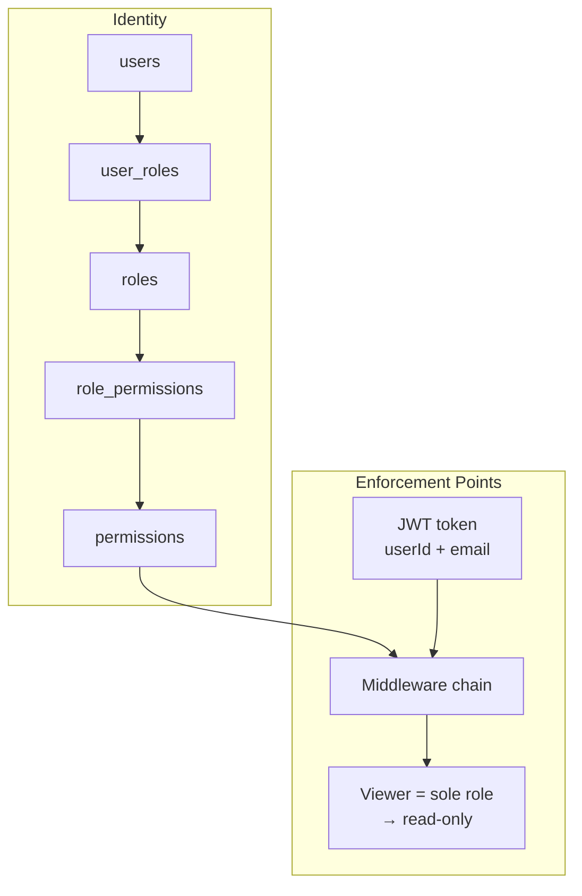

| Layer | Mechanism |
|-------|-----------|
| Authentication | bcrypt passwords, JWT (HS256), `/api/auth/me` refresh |
| Authorization | 26 permission codes, role bundles, per-route checks |
| Viewer | Sole Viewer role blocked on all non-GET |
| Audit | CREATE / UPDATE / DELETE / STATUS_CHANGE / LOGIN |

---

## 6. Data Architecture

### Entity relationship (core domain)

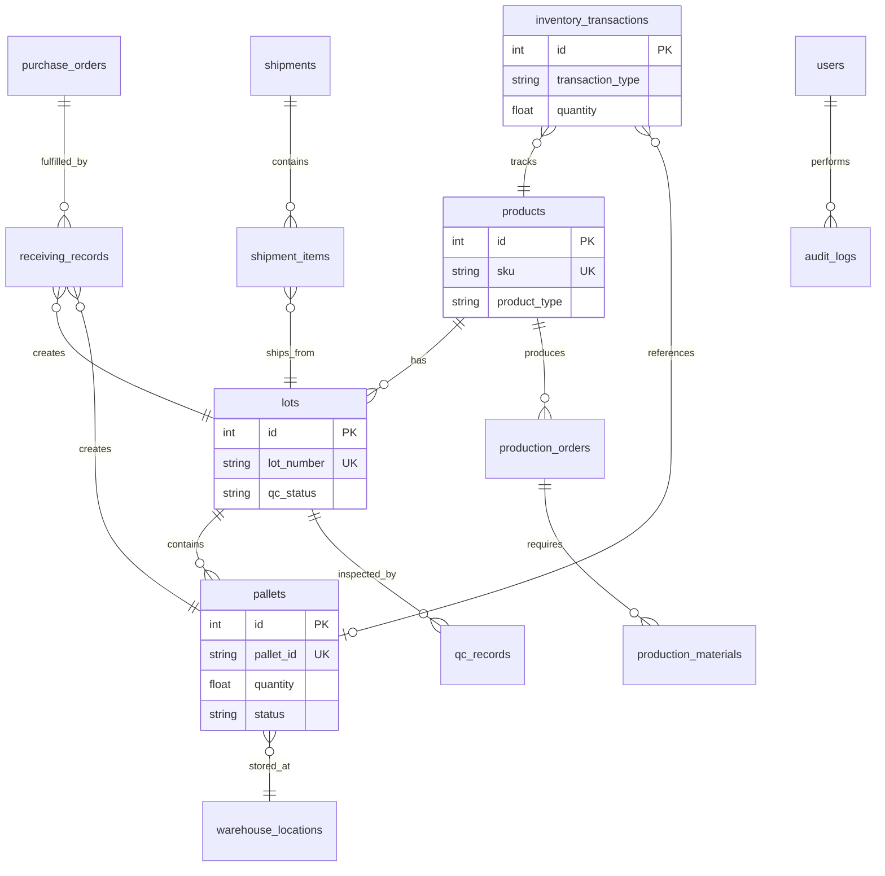

### Inventory truth model

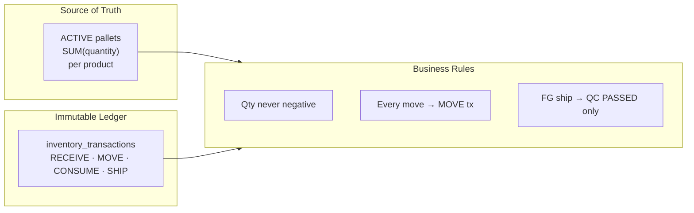

---

## 7. Operational Flow Architecture

End-to-end warehouse lifecycle.

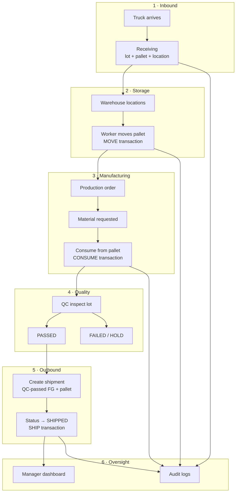

### State machines

**Production order**

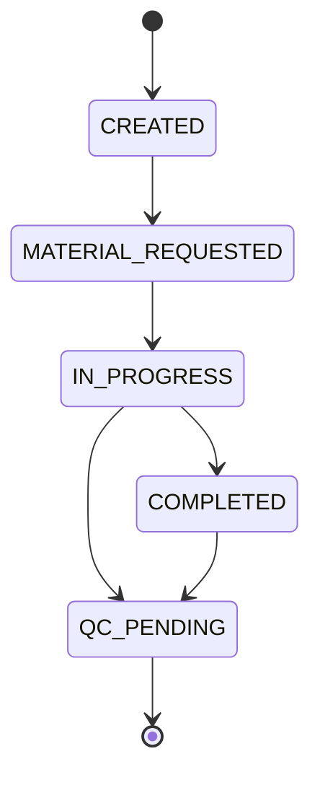

**Shipment**

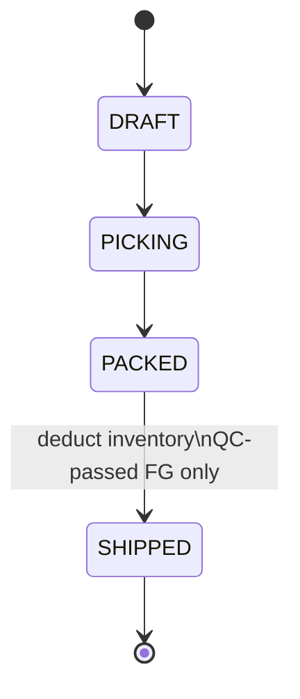

**Lot QC**

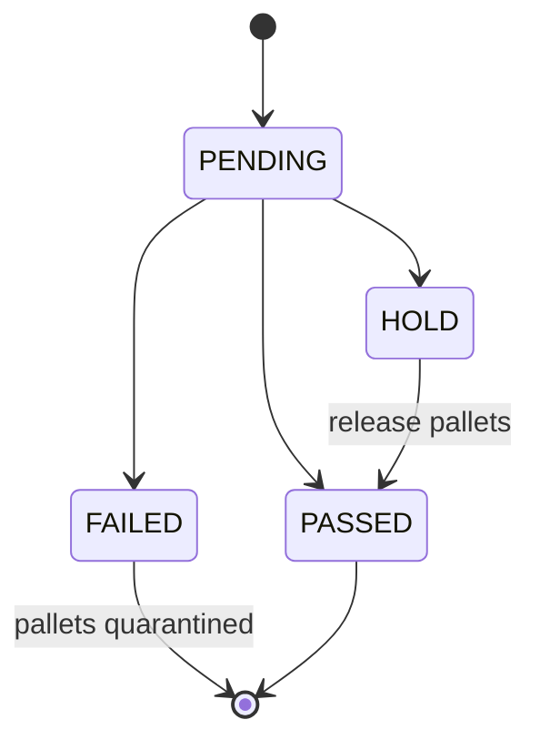

---

## 8. Module Map

How functional modules map to code.

| Module | Backend route | Frontend page | Key permissions |
|--------|---------------|---------------|-----------------|
| Auth | `/api/auth` | LoginPage | public / session |
| Dashboard | `/api/dashboard` | DashboardPage | `dashboard.read` |
| Products | `/api/products` | ProductsPage | `products.read/write` |
| Lots | `/api/lots` | LotsPage | `lots.read/write` |
| Pallets | `/api/pallets` | PalletsPage | `pallets.read/move` |
| Locations | `/api/locations` | LocationsPage | `locations.read/write` |
| Receiving | `/api/receiving` | ReceivingPage | `receiving.read/write` |
| Production | `/api/production-orders` | ProductionOrdersPage | `production.*` |
| QC | `/api/qc` | QCPage | `qc.read/write` |
| Shipping | `/api/shipments` | ShippingPage | `shipping.read/write` |
| Inventory history | `/api/inventory-transactions` | InventoryTransactionsPage | `inventory.read` |
| Audit | `/api/audit-logs` | AuditLogsPage | `audit.read` |
| Users & roles | `/api/users`, `/api/roles` | UsersPage | `users.read`, `roles.read` |

---

## 9. Deployment Architecture (Local)

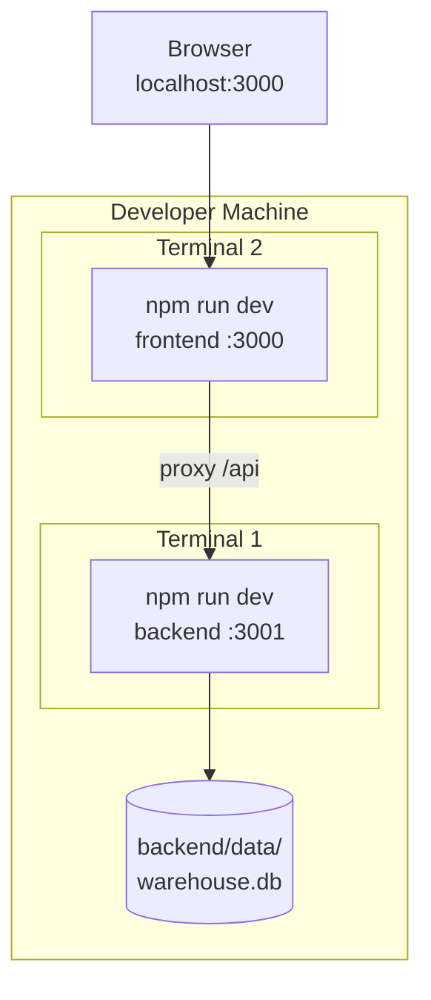

| Concern | Local setup |
|---------|-------------|
| Frontend | http://localhost:3000 |
| API | http://localhost:3001 |
| Database | SQLite file, auto-init on first run |
| Secrets | `backend/.env` — JWT_SECRET, PORT |

---

## 10. Cross-Cutting Concerns

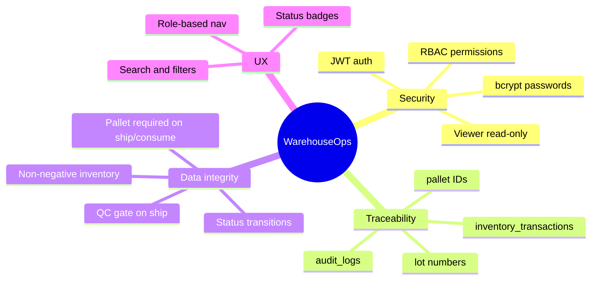

---

## 11. Future Architecture (not implemented)

Planned extensions that fit the current design without rewrites:

| Extension | Approach |
|-----------|----------|
| ERP integration | Webhook or polling adapter → `/api/receiving` |
| Barcode scanning | Frontend scanner component → pallet/location IDs |
| PostgreSQL | Swap `db/index.ts` driver; keep schema + services |
| Multi-warehouse | Add `warehouse_id` FK to locations/pallets |
| Inventory adjust API | New route gated on `inventory.adjust` |
| Real-time dashboard | SSE or WebSocket from dashboard service |

---

## Document map

| Document | Purpose |
|----------|---------|
| [spec.md](../spec.md) | What to build |
| [design.md](../design.md) | Technical design & API detail |
| **architecture.md** (this file) | Visual system architecture |
| [tasks.md](../tasks.md) | Implementation tasks |
| [README.md](../README.md) | How to run |
